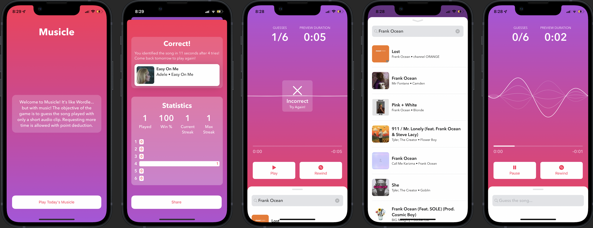

# Hi, my name is Ethan Fox

I am an undergraduate student at the College of Electrical and Computer Engineering at Georgia Tech, and I am from rural North Georgia. 

## Current Areas of Focus 
Just a list of stuff that have been in my life recently 

### Teaching Assistant
I currently work with the College of Computing at Georgia Tech as an Undergraduate Teaching Assistant for the Data Structures and Algorithms class. 

### iOS Club
I am a senior developer at the Georgia Tech iOS Club. Last year, I worked with a team and we created a game called Musicle! It won first place in the Spring 2022 iOS Club Demo Day. It was a great opportunity to learn more about Swift and developing for Apple platforms. This year I hope to go even farther and learn even more.

## Interests
I find design really interesting. I am currently pursuing a minor in Industrial Design. I love getting to read about the design process. Some books I've found really insightful have been *After Steve* and *The Collected Angers*.

## Previous Projects

### Musicle
Musicle was a game I helped make with a handful of members of the iOS Club. It was a game similar to Wordle, but the objective of the game was to recognize the song being played be the shortest amount of time. This was my first big introduction to developing for Apple platforms, and I thought it was really cool! I learned a lot about Swift and UIKit, and it was a total blast. 

